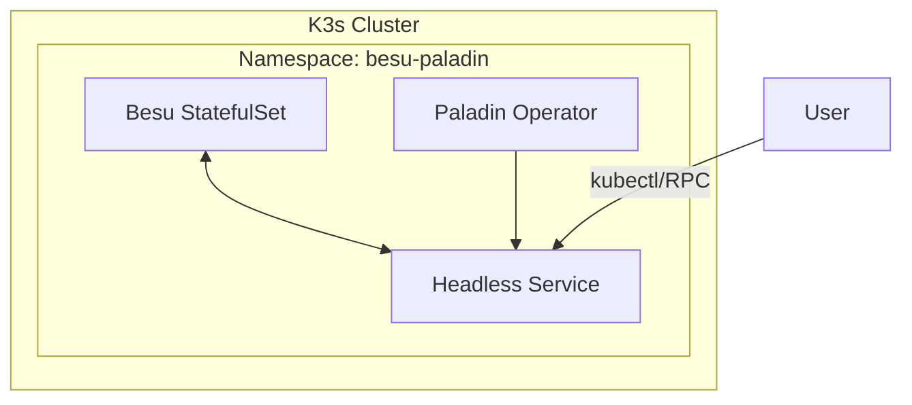

# Besu + Paladin Dev Network

A local development environment for deploying a private **Hyperledger Besu 25.x** network with **Paladin** on **k3s (Rancher Desktop)**.

> **⚠️ WARNING**: This project is for **development and testing purposes only**. Do not use in production.

## 🚀 Features

* **Consensus**: QBFT (4 nodes minimum).
* **Privacy**: Integrated Paladin with `noto`, `zeto`, and `pente` domains.
* **Gas**: Zero gas fees (EIP-1559 `zeroBaseFee` + `min-gas-price=0`).
* **Storage**: Efficient Bonsai storage format.
* **Architecture**: Besu StatefulSet + Paladin Operator.

## 📋 Prerequisites

* **Rancher Desktop** (running k3s)
  * Resources: 8GB+ RAM, 4+ CPUs
* **Tools**: `docker`, `kubectl`, `helm`, `jq`, `make`

## 🛠️ Quick Start

This project uses a `Makefile` to automate the deployment lifecycle.

### 1. Generate & Build

Generate validator keys, genesis file, and Kubernetes manifests.

```bash
make generate   # Generate keys and genesis
make build      # Build K8s manifests and configs
```

### 2. Deploy

Deploy the network to your local k3s cluster.

```bash
make deploy     # Deploy Besu and Paladin
```

### 3. Verify

Check if the network is up and peering correctly.

```bash
make verify     # Check peers, block production, and health
```

### One-liner

Run the entire sequence:

```bash
make all
```

## ⚙️ Configuration

Key network variables can be customized in `config/network.env`:

* `NETWORK_NAME`: Name of the network/namespace (default: `besu-paladin`)
* `NODE_COUNT`: Number of validator nodes (default: `4`)
* `CHAIN_ID`: Chain ID (default: `1337`)

## 🏗️ Architecture



## 🧹 Cleanup

To remove the network and generated files:

```bash
make clean      # Delete namespace and generated files
```
